# pvtop

A simple utility for watching pre-vote status on Tendermint chains. It will print out the current pre-vote status for each validator in the validator set. Useful for watching pre-votes during an upgrade or other network event causing a slowdown.

## Basic Chain Usage

```
pvtop tcp://localhost:26657
```

## Consumer Chain Usage

This is only for consumer chains of the Cosmos Hub

```
pvtop tcp://consumer:26657 tcp://provider:26657
```

## Example



## Install

```
git clone https://github.com/blockpane/pvtop
cd pvtop
go install ./...
```
